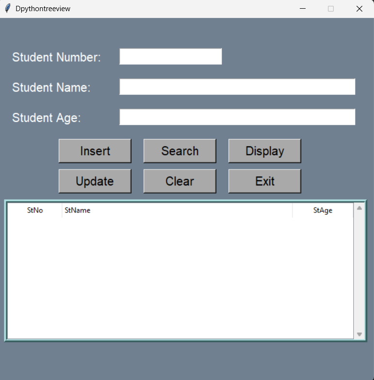
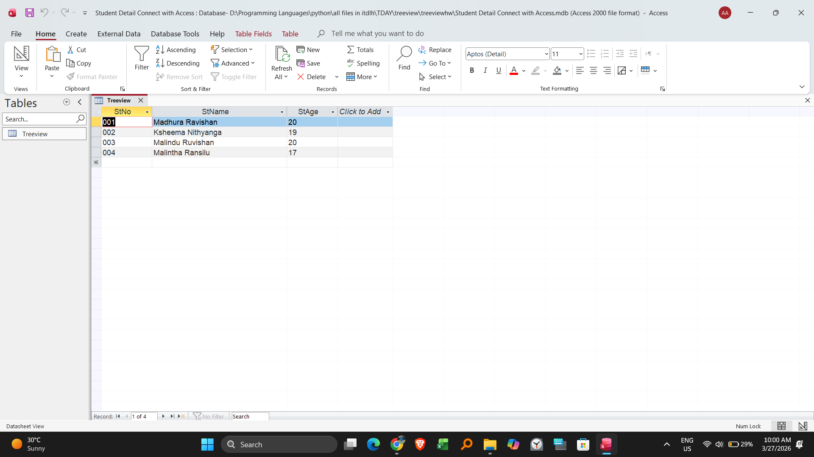

# 🎓 Student Management System (CRUD Application)

A fully functional desktop application designed to manage student data. This project demonstrates full-stack software development principles by connecting a Python graphical user interface to a persistent relational database.

### 📸 Project Interface & Database
| Application Front-End (Tkinter) | Back-End Database (MS Access) |
| :---: | :---: |
|  |  |

### ✨ Core Features (CRUD)
This application successfully implements all four fundamental functions of persistent storage:
* **Create (Add):** Collects user input via Tkinter Entry widgets and inserts new records directly into the connected database.
* **Read (Search):** Queries the database using a student's ID and retrieves their specific information to display on the screen.
* **Update:** Allows the user to modify existing student records and push those changes back to the database.
* **Delete:** Safely removes a selected student record from the database entirely.
* **Clear:** A utility function to instantly reset the form fields for the next task.

### 🛠️ Built With
* **Python 3**
* **Tkinter:** For the graphical user interface.
* **Microsoft Access (`.mdb`):** Used as the local relational database for persistent data storage.

### 🚀 How to Run
To run this application, you must ensure the Python script and the database file (`Student Detail Connect with Access.mdb`) remain in the same folder.

1. Clone or download this repository.
2. Ensure you have the necessary ODBC drivers installed on your Windows machine to allow Python to communicate with MS Access databases.
3. Open your terminal or command prompt.
4. Run the application:
   ```bash
   python "Student DEtail Connect with Access.py"
